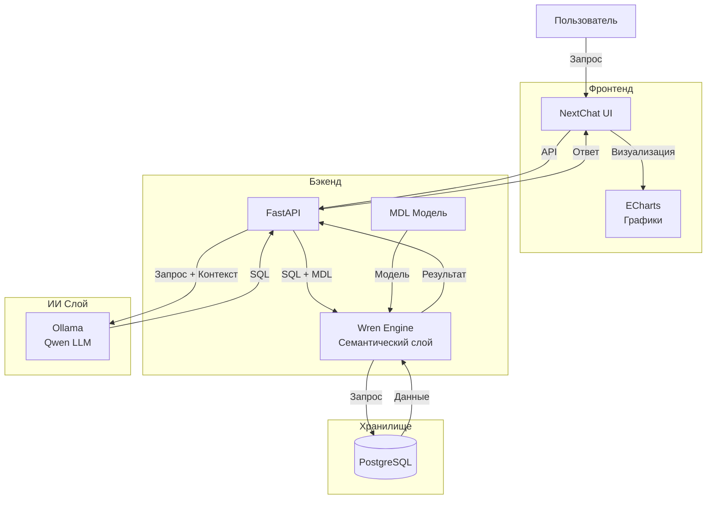

# Text-to-SQL System

## Инструкция по развертыванию

### 1. Описание системы



Компоненты:
* Frontend:
    * NextChat
    * Отображение диалога и визуализаций через Apache ECharts
* Backend:
    * FastAPI
    * Генерация SQL запросов
    * Выполнение SQL запросов
    * Формирование результата
* Ollama
    * Локальный запуск языковой модели Qwen
    * Генерация SQL запросов
* Wren CLI
    * Работа с метаданными базы данных
    * Выполнение SQL запросов
    * Управление моделью данных
* PostgreSQL
    * Хранение исходных данных

### 2. Требования 

Перед запуском необходимо установить:
* Docker
* Docker Compose
* Nvidia Container Toolkit (если используется GPU)

Минимальные требования к системе:
* RAM: 16 GB
* GPU: Nvidia с поддержкой CUDA ядер
* Свободное место: 20 GB

### 3. Настройка проекта
#### 3.1 Настройка переменных окружения
Первым делом склонируйте репозиторий к себе.

В корне проекта необходимо создать файл `.env`

Пример:
```
POSTGRES_DB=departments_test
POSTGRES_USER=postgres
POSTGRES_PASSWORD=postgres
POSTGRES_HOST=localhost
POSTGRES_PORT=5432

OLLAMA_URL=http://localhost:11434
OLLAMA_MODEL=qwen2.5-coder:7b
```

#### 3.2. Настройка Wren

Поместите ваш backup с БД для контейнера Postgres в директорию database.
1. Установить пакет python3.13-venv, если его нету
```bash
sudo apt install python3.13-venv
```

2. Создайте виртуальную среду Python
```bash
python3 -m venv ~/.venvs/wren
source ~/.venvs/wren/bin/activate
```

3. Установка WrenCLI
```bash
pip install "wrenai[memory,main]"
```

4. Самый важный шаг при работе с Wren

Чтобы Wren успешно работал с вашей БД, нужно сгенерировать MDL файл на основе YAML файлов.
Для этого лучше воспользоваться стороннeй моделью ИИ, которая сгенерирует корректно ваши yml файлы. Хотя их можно прописать и вручную.

В проекте создана такая структура:
```
wren/
├── models/
│   ├── departments/
│   │   └── metadata.yml
│   ├── employees/
│   │   └── metadata.yml
│   └── ...
├── relationships.yml
└── wren_project.yml
```
Для каждой таблицы базы данных необходимо создать файл metadata.yml, содержащий описание таблицы, её столбцов и первичного ключа.

Пример заполненного metadata.yml для таблицы departments:
```yml
name: departments

table_reference:
  catalog: ""
  schema: public
  table: departments

primary_key: id

properties:
  description: "Company departments"

columns:
  - name: id
    type: INTEGER
    not_null: true

  - name: name
    type: VARCHAR
    properties:
      description: "Department name"
```

Создайте YML файлы для каждой вашей таблицы обязательно. 
Таким же образом заполните relationships.yml, пример есть в проекте. 

5. Создание профиля Wren

Нужно создать профиль в Wren для генерации MDL.
Наш Wren находится в контейнере backend. Поэтому для этого зайдем внутрь контейнера и продолжим работу с ним там.

Сначала поднимем docker compose:
```bash
docker compose up -d
```

Войдем в контейнер и создадим профиль Wren:
```bash
docker compose exec backend bash
cd wren/
wren profile add --interactive
```

Пример заполнения, в зависимости от вашей конфигурации:
```bash
Data source: postgres
  Host (localhost): postgres
  Port (5432): 5432
  Database (postgres): name_database
  User (postgres): postgres
  Password: 
```

Установка профиля для контекста:
```bash
wren context set-profile postgres
```

Валидация контекста:
```bash
wren context validate
```

Если ошибок не нашлось, то собираем наш MDL.json:
```bash
wren context build
```

Проверим на живучесть наш backend:
```bash
curl -X 'GET' \
  'http://localhost:8000/health' \
  -H 'accept: application/json'
```

Если вернулся `{"status":"ok"}` значит все хорошо. Продолжаем дальше.

#### 3.3. Настройка Ollama и выбор модели

Зайдем в контейнер Ollama и поставим модель:
```bash
docker compose exec ollama bash
```
Установите qwen2.5
```bash
ollama pull qwen2.5-coder:7b
```

Перезапустите контейнеры:
```bash
docker compose restart
```

#### 3.4. Настройка NextChat + Apache Echarts

Установите npm, если его нет:
```bash
sudo apt install npm
```

Установим все зависимости от NextChat и Apache Echarts:
```bash
npm install
```

Создайте в корне NextChat `.env.local` файл и заполните его примерно так(либо под вашу конфигурацию):
```bash
OPENAI_API_KEY=dummy

BASE_URL=http://localhost:8000

CUSTOM_MODELS=text-to-sql
```

Запустите frontend часть:
```bash
npm run dev
```
Зайдите на localhost:3000 и протестируйте систему.