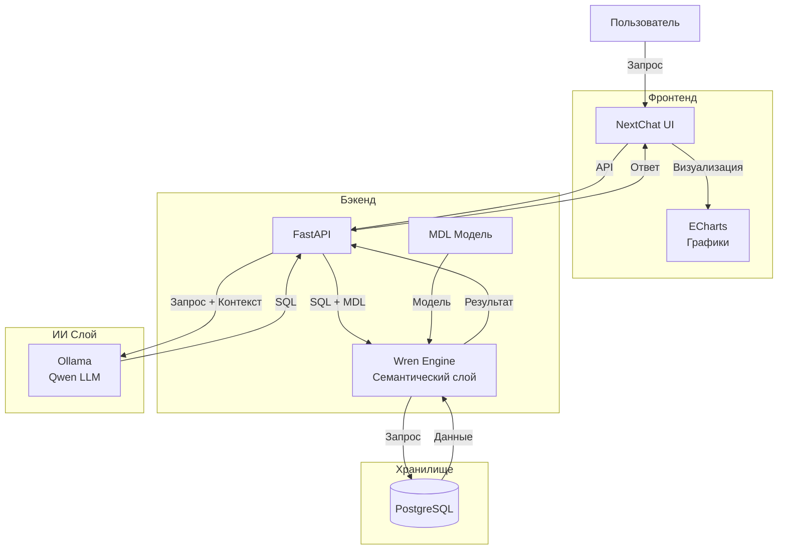

# Text-to-SQL

Система генерации SQL-запросов на естественном языке с использованием локальной LLM.

Пользователь задает вопрос обычным языком, после чего система:
1. Анализирует структуру базы данных через Wren Semantic Layer.
2. Генерирует SQL запрос с помощью локальной LLM Qwen.
3. Выполняет запрос в PostgreSQL.
4. Возвращает результат пользователю в удобном виде.
5. При необходимости строит визуализацию через Apache ECharts.

---

## Архитектура



---

# Используемые технологии

## Frontend

- [NextChat](https://github.com/chatgptnextweb/nextchat)
- [Apache ECharts](https://github.com/apache/echarts)

Назначение:
- пользовательский интерфейс;
- отправка запросов;
- отображение результатов;
- построение графиков.

---

## Backend

- Python
- FastAPI
- OpenAI-compatible API

Назначение:
- обработка пользовательских запросов;
- взаимодействие с LLM;
- управление выполнением SQL;
- формирование ответа.

---

## AI Layer

### Ollama

Используется для локального запуска языковой модели.

Поддерживаемая модель(с другими не тестил):

```
qwen2.5-coder:7b
```

Назначение:
- генерация SQL запросов;
- преобразование естественного языка в SQL.

---

## Semantic Layer

### Wren Engine

Используется для:

- описания бизнес-модели данных;
- хранения метаданных;
- генерации корректного SQL;
- абстрагирования структуры базы данных от LLM.

Модель данных описывается через MDL.

---

## Database

### PostgreSQL

Используется как основное хранилище данных.

---

# Требования

Минимальные:

- Docker
- Docker Compose
- 16 GB RAM

Рекомендуемые:

- NVIDIA GPU
- 8+ GB VRAM
- NVIDIA Container Toolkit

---

# Установка и запуск

Полная инструкция по настройке находится в отдельном документе:
[Подробная документация](Documentation.md)